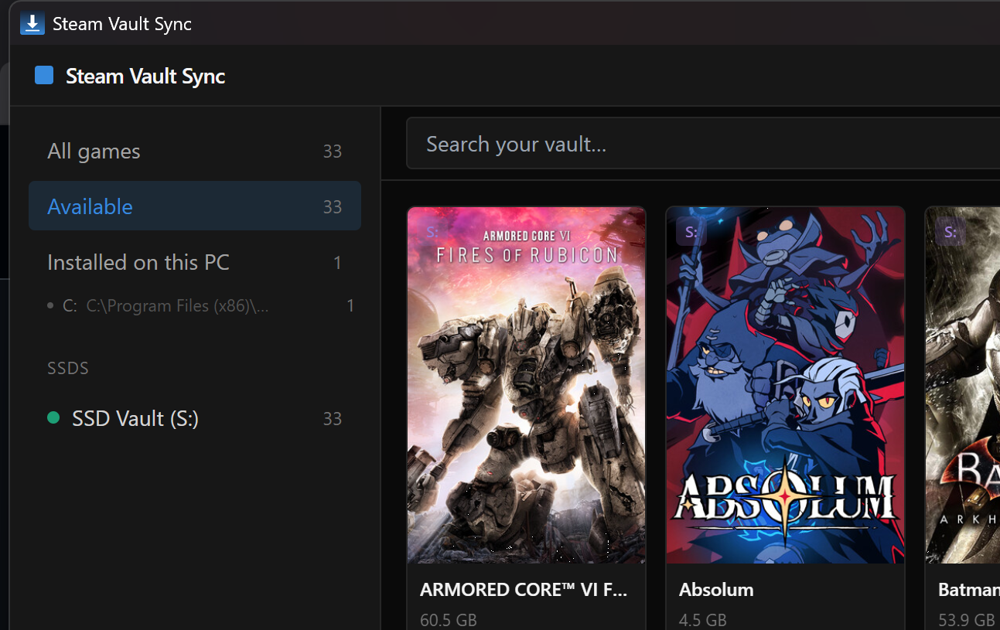

# Steam Vault Sync

> Manage your Steam game library across external SSDs. Browse everything
> on your vault drive from one place, copy what you want to play to your
> PC, launch in Steam, and clean it up when you're done — without ever
> touching the vault copy.



## Why this exists

If you have a 2 TB+ Steam library that doesn't fit on your internal SSD,
the usual answer is to keep the games on an external drive and play them
from there. That works, but it's slow (USB SSD bandwidth + Steam's I/O
patterns) and the drive has to stay plugged in.

The better answer: treat the external SSD as a **vault** — a complete
read-only mirror of your library — and copy games to your fast internal
SSD only when you want to play. When you're done with a game, remove
the local copy. The vault is untouched and always there for next time.

Steam Vault Sync is the desktop app that makes this workflow nice.

## Features

### Vault library management
- **Browse your vault(s)** — cover art, titles, sizes, and Steam
  buildids for every game across every connected vault SSD, even when
  a vault is disconnected. The catalog persists on each SSD in its own
  SQLite database (`vaultsync.db`).
- **Multi-vault support** — connect any number of vault SSDs at once.
  Auto-discovery probes A:–Z: for `vaultsync.db` on every hot-plug
  tick. Click any vault in the sidebar to filter the grid to just
  that vault's games.
- **Copy between vaults** — via the ⋯ menu on any card; useful for
  mirroring a backup vault or splitting your collection across drives.
- **Delete from vault** — irreversibly removes the game folder,
  `appmanifest_*.acf`, the catalog row, AND the vault's entry in
  Steam's `libraryfolders.vdf` so Steam stops tracking it.
- **Local-only view** — a separate sidebar entry surfaces games
  installed on your PC's local Steam libraries that aren't in any
  vault yet. One click backs them up.

### The staged-update workflow (the killer feature)
Steam patching games installed on a USB SSD is unbearably slow —
hundreds of MB taking *hours* of random I/O. Steam Vault Sync routes
patches through your fast internal NVMe instead:

1. Outdated games get an orange **Update** badge (detected via the
   appmanifest `StateFlags` — same signal Steam's own UI uses).
2. Click **↻ Update Vault**. The app: copies the vault game to local
   (sequential USB read, fast), temporarily edits
   `libraryfolders.vdf` so Steam only sees the local install,
   gracefully closes Steam, then triggers `steam://install/<appid>`.
3. Steam patches the local copy on your NVMe (fast random I/O).
4. When Steam finishes, the app pushes the updated local copy back to
   the vault (sequential USB write), restores `libraryfolders.vdf`,
   and asks whether to keep the local copy.

Total time on a real test: **15 minutes** for a 300 MB patch on a
90 GB game, vs **>1 hour** for Steam patching the vault directly.

### Copy operations
- **One-click copy vault → local** with library picker if you have
  multiple Steam libraries on your PC.
- **Pause / Resume / Cancel** — all copies (vault→local, local→vault,
  vault→vault) honor the same control state at 4 MB chunk boundaries.
- **Atomic vault writes** — pushes write to `<game>.partial` then
  rename-swap, so an interrupted update never leaves your vault in a
  broken state.
- **Real-time progress** — speed, ETA, % shown both in the app and in
  the system tray tooltip while minimized.

### Steam integration
- **Auto-register** copied games with Steam via `steam://install/<appid>`.
- **Launch directly** from installed games via `steam://rungameid/<appid>`.
- **Clean uninstall** removes the game folder, manifest, downloading
  cache, and workshop content so Steam correctly sees the game as
  not installed.
- **Multi-library awareness** — reads every Steam library in
  `libraryfolders.vdf`, shows a per-drive breakdown under "Installed
  on this PC", and excludes vault drives from the local list.
- **Cover art with zero config** — reads `appmanifest_*.acf` to map
  folder → AppID, then pulls covers from Steam's CDN. No API key.
- **Buildid display** — each card shows the vault's installed build
  number and the local copy's build number (highlighted amber when
  they differ).

### Quality of life
- **System tray** — close-to-tray, hover-for-progress tooltip during
  long copies, explicit Show / Exit menu.
- **Hot-plug** — connect or disconnect any vault and the UI updates
  within 3 seconds.
- **Smart filters** — All, Available, Installed on PC, Updates
  available (count badge), Local only, and per-vault filtering.

## Quick start (use the prebuilt binary)

1. Grab the latest release from the
   [Releases page](https://github.com/lrsanchez/steam-vault-sync/releases)
   — either the standalone `Steam Vault Sync.exe`, the NSIS
   installer, or the MSI.
2. The app requires **Microsoft Edge WebView2 Runtime**. On Windows 11
   it's pre-installed. On Windows 10 the installer will fetch it
   automatically if missing. For the standalone .exe on a stripped
   machine, install it from
   <https://developer.microsoft.com/microsoft-edge/webview2/>.
3. Run it. The app expects your vault SSD at drive letter **S:** by
   default — you can change this in Settings.

That's it. No Node, no Rust, no npm. The .exe is self-contained.

## Set up your vault SSD

Steam Vault Sync expects the standard Steam library layout on the SSD:

```
S:\
  SteamLibrary\
    steamapps\
      common\
        Elden Ring\
        Cyberpunk 2077\
        ...
      appmanifest_1245620.acf
      appmanifest_1091500.acf
      ...
  vaultsync.db          ← created automatically on first launch
```

The easiest way to get there:

1. Plug in your SSD.
2. In Steam → Settings → Storage → **Add Drive** → pick the SSD. Steam
   creates `SteamLibrary\steamapps\common\` for you.
3. Move or install games onto the SSD via Steam as usual.
4. Launch Steam Vault Sync. The first time you point it at the SSD it
   creates `vaultsync.db` and scans the games automatically.

You can also use an SSD that's been used as a Steam library on
another PC — just plug it in and the app will read the existing
`appmanifest_*.acf` files to identify everything.

## Typical workflow

1. **Browse** — open Steam Vault Sync, see your whole vault.
2. **Pick a game** — click **Copy to PC**. If you have multiple Steam
   libraries on your PC, pick one. Progress panel shows speed + ETA.
3. **Play** — when the copy finishes, Steam pops up and the game is
   ready. Or click the **Launch Game** button right in Steam Vault Sync.
4. **Done?** — click the **✕** on the game card to fully uninstall the
   local copy. The vault copy is untouched.

You can keep multiple games installed locally at once; the sidebar
shows totals per drive.

## Build from source

You need:

- **Node.js** 20+
- **Rust** stable (with the `x86_64-pc-windows-msvc` target)
- **Visual Studio 2022 Build Tools** with the "Desktop development
  with C++" workload (for the MSVC linker)
- **WebView2 Runtime** (almost certainly already installed)

Then:

```powershell
git clone https://github.com/lrsanchez/steam-vault-sync.git
cd steam-vault-sync

npm install

# Dev mode (HMR for React, recompile-on-save for Rust)
npm run tauri dev

# Release build — produces .exe, MSI, and NSIS installer
npm run tauri build
```

Build outputs land in `src-tauri/target/release/`:

- `vaultsync.exe` — the standalone binary
- `bundle/msi/Steam Vault Sync_0.1.0_x64_en-US.msi`
- `bundle/nsis/Steam Vault Sync_0.1.0_x64-setup.exe`

## Tech stack

- **[Tauri 2.x](https://tauri.app/)** — desktop shell, Rust backend +
  WebView2 frontend (much smaller bundles than Electron)
- **React 18 + TypeScript + Vite** — UI
- **Tailwind CSS** — styling
- **Zustand** — frontend state
- **SQLite** (via `rusqlite`) — per-SSD game catalog
- **keyvalues-parser** — Steam's VDF format

## Roadmap ideas

Things I might add (PRs welcome under the
[contribution terms](#contributing)):

- Support for non-Steam games (manual cover art entry)
- SteamGridDB integration for games whose `appmanifest_*.acf` is missing
- Bandwidth throttling for copies
- Linux / macOS support (currently Windows-only)
- Automatic updater for the app itself

## Contributing

Bug reports, feature requests, and small PRs are welcome. By submitting
a PR you agree your contribution is licensed under the same terms as
the rest of the project (see [LICENSE](LICENSE)).

For larger changes please open an issue first to discuss the direction.

## License

**[PolyForm Noncommercial 1.0.0](LICENSE)** — free for personal use,
hobby projects, research, education, and non-profits. Commercial use
(selling, paid hosting, monetized distribution) requires a separate
license — email
[leandrorsanchez@gmail.com](mailto:leandrorsanchez@gmail.com).

## Credits

Created by **Leandro Sanchez** and **Claude**.

Built with [Tauri](https://tauri.app/),
[React](https://react.dev/), and
[Claude Code](https://claude.com/claude-code).

Steam and the Steam logo are trademarks of Valve Corporation. This
project is not affiliated with or endorsed by Valve.
